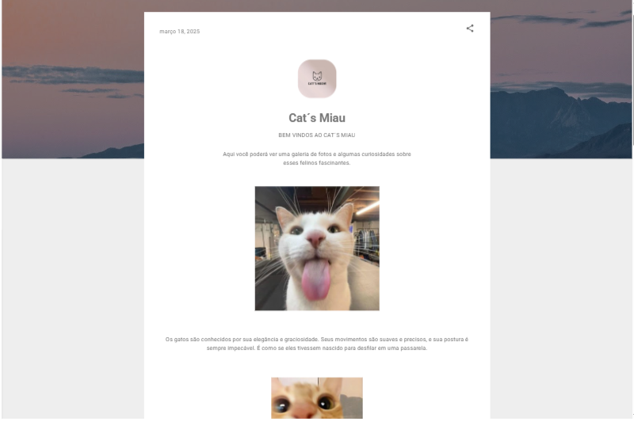

# Nome da Startup: Cat´s Miau
## Slogan: Um miau para cada foto e curiosidade.

# Breve Descrição:
Aqui você pode encontrar fotos e curiosidades dos felinos de forma rápida.

# Missão:

Fornecer imagens e conteúdos vizados ao mundo dos felinos.

# Visão: 
Nosso intuito é trazer os detalhes curioidades e muito mais sobre os gatos, animais esses que conquistam o corações de todos os humanos.

## Metas de Longo Prazo:

1.  Expandir nosso site para redes sociais.
2.  Atualizar mensalmente.
3.  Tornar acessível a todos os amantes de gato.

## Planos de Ação:

### Meta 1: Expandir nosso site para redes sociais.

* Ação 1: Desenvolver uma estratégia de marketing digital abrangente.
* Ação 2: Criar um programa de indicações para clientes satisfeitos.
* Ação 3: Criar eventos da marca.

### Meta 2: Atualizar mensalmente.

* Ação 1: Realizar pesquisas de mercado para identificar novos assuntos.
* Ação 2: Investir em pesquisa e desenvolvimento de novas estratégias.

### Meta 3: Tornar acessível a todos os amantes de gato .

* Ação 1: Arranjar parcerias para divulgação.

## Recursos Necessários:

* Equipe de marketing digital;
* Equipe de pesquisa e desenvolvimento;
* Parcerias com empresas ou epaços de veterinária;

## Orçamento:

* Meta 1: R$ 500.000
* Meta 2: R$ 1.000.000
* Meta 3: R$ 200.000

## Cronograma:

* Meta 1: Início imediato, com acompanhamento trimestral.
* Meta 2: Início em 1 ano, com lançamentos anuais.
* Meta 3: Início em 2 anos, com metas parciais anuais.

## Métricas de Sucesso:

* Número de novos users
* Novas parcerias
* Mais desenvolvimento

## Equipe:

* \[Nome do fundador]: Ana Larissa Mendes
* \[Nome do colaborador/vice]: Daiara Barroso

## Contato:

* Email: gato.meow@miau.com
* Website: https://www.blogger.com/blog/post/edit/2264914610301352471/7215615312382198059
